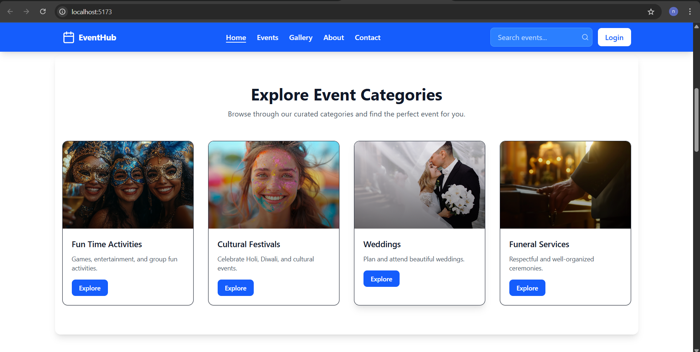
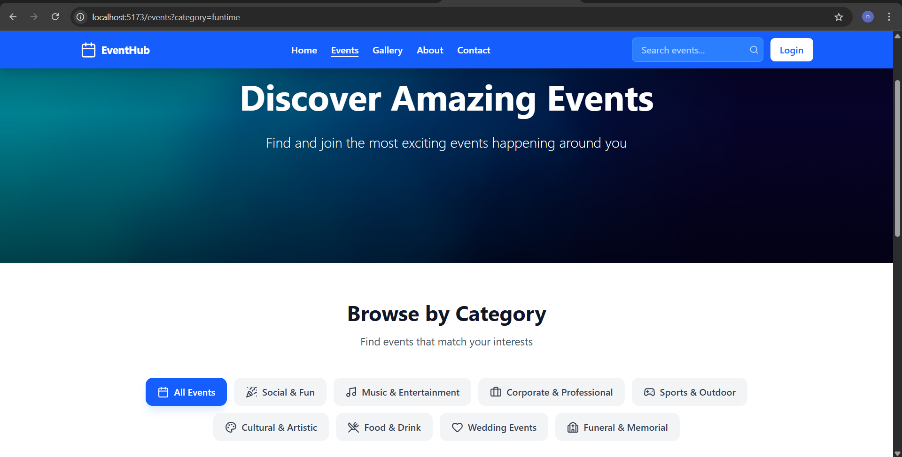
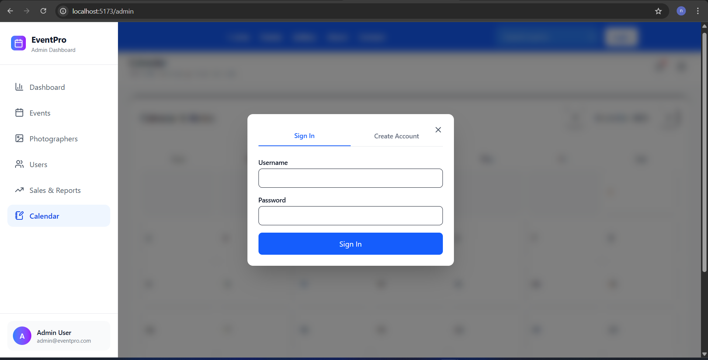
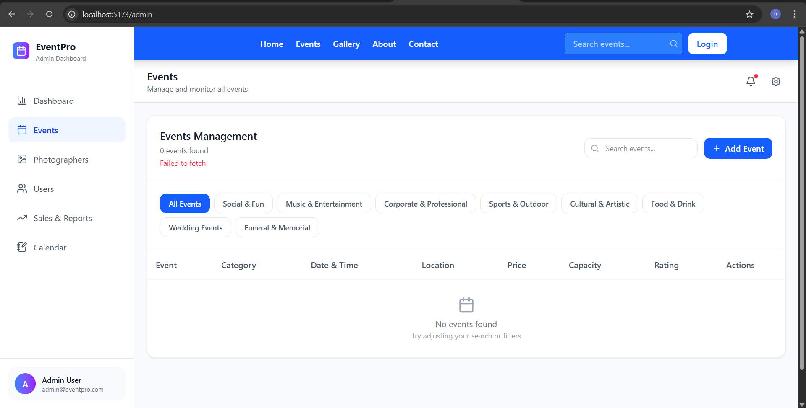
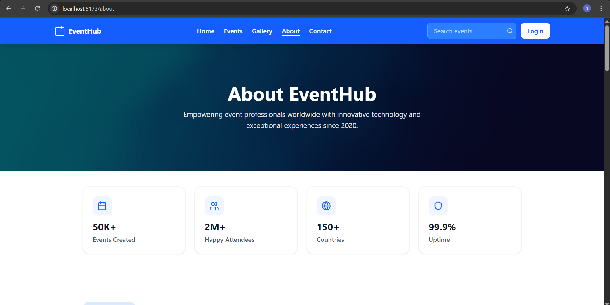
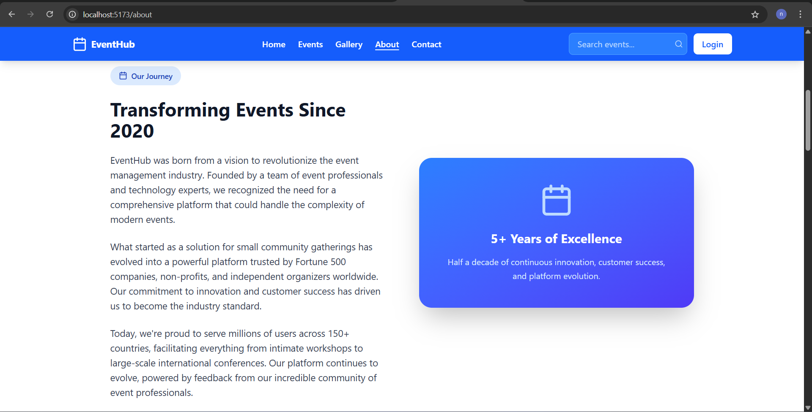
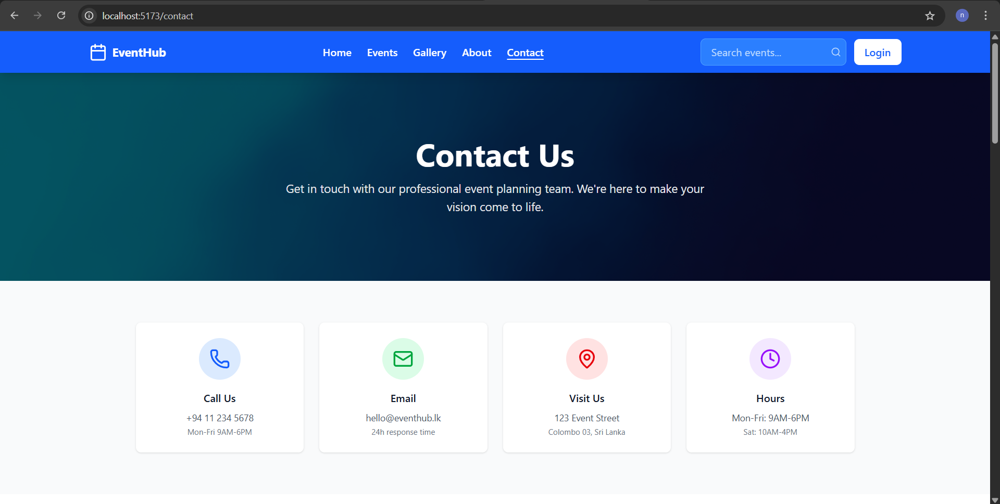

# React + Vite

This template provides a minimal setup to get React working in Vite with HMR and some ESLint rules.

Currently, two official plugins are available:

- [@vitejs/plugin-react](https://github.com/vitejs/vite-plugin-react/blob/main/packages/plugin-react) uses [Babel](https://babeljs.io/) for Fast Refresh
- [@vitejs/plugin-react-swc](https://github.com/vitejs/vite-plugin-react/blob/main/packages/plugin-react-swc) uses [SWC](https://swc.rs/) for Fast Refresh

## Expanding the ESLint configuration

If you are developing a production application, we recommend using TypeScript with type-aware lint rules enabled. Check out the [TS template](https://github.com/vitejs/vite/tree/main/packages/create-vite/template-react-ts) for information on how to integrate TypeScript and [`typescript-eslint`](https://typescript-eslint.io) in your project.


# 🎉 Event Management System (EventHub + EventPro)

A full-stack, modern event management system that includes:

- 🧑‍🤝‍🧑 A **public-facing portal** for discovering and exploring events (EventHub)
- 👩‍💼 A **professional admin dashboard** for managing events, photographers, and analytics (EventPro)

Built with **React**, **Vite**, and a sleek responsive UI.

---
# 🎉 Event Management System

An advanced **Event Management System** built with **React**, **PHP RESTful APIs**, and **PostgreSQL**, designed to simplify the process of planning, organizing, and managing events efficiently.

## 🚀 Overview

This system allows users and administrators to manage every aspect of an event — from creation and registration to real-time updates and reporting. The platform provides a responsive, user-friendly interface with secure backend API handling and a powerful PostgreSQL database.

## 🧩 Tech Stack

* **Frontend:** React JS (Vite + Tailwind CSS)
* **Backend:** PHP (RESTful API)
* **Database:** PostgreSQL
* **Hosting:** XAMPP / Localhost (Development)
* **Version Control:** Git & GitHub

## ⚙️ Features

### 👥 User Side

* Register and log in securely
* Browse upcoming and past events
* Register for events and view participation status
* Receive event updates and notifications

### 🛠️ Admin Side

* Create, edit, and delete events
* Manage event participants and details
* Generate event reports (daily/weekly/monthly)
* Dashboard overview with analytics and activity logs

## 🧠 System Architecture

The frontend communicates with the backend through **PHP-based REST APIs**, which interact with the **PostgreSQL database** for data operations like event creation, registration, and reporting.

```
React (UI) ⇄ PHP REST API ⇄ PostgreSQL (Database)
```

## 📂 Folder Structure (Example)

```
/event-management-system
│
├── /frontend       # React app (UI)
│   ├── src/
│   ├── public/
│   └── package.json
│
├── /backend        # PHP API
│   ├── api/
│   ├── config/
│   └── index.php
│
└── /database       # SQL scripts for PostgreSQL
    └── event_system.sql
```

## 💾 Setup Instructions

1. Clone the repository

   ```bash
   git clone https://github.com/yourusername/event-management-system.git
   ```
2. Navigate to the project directory

   ```bash
   cd event-management-system
   ```
3. Set up the backend

   * Import the SQL file into PostgreSQL
   * Update database credentials in `backend/config/db.php`
4. Start the React frontend

   ```bash
   cd frontend
   npm install
   npm run dev
   ```

## 📈 Future Enhancements

* Email and SMS notifications
* Online payment integration
* Role-based access control
* Event feedback and rating system

## 🧑‍💻 Developed By

**Niven Asmitha Liyanage**
Software Engineering Student | LNBTI |
📧 [nivenasmitha345@gmail.com](mailto:nivenasmitha345@gmail.com)

---

⭐ *If you like this project, consider giving it a star on GitHub!*


## 🖼️ Screenshots

### 🏠 Home Page – Public Site


### 🎨 Event Categories


### 💬 User Testimonials


### 📅 Event Calendar View


### 🔐 Login & Authentication


### 📋 Event Listings (Admin)


### ➕ Add Photographer Modal


### 📊 Admin Dashboard Overview


### 🧑‍💼 About Us (Company Info)



### 📩 Contact Page (Form)


### 📞 Contact Info Section


